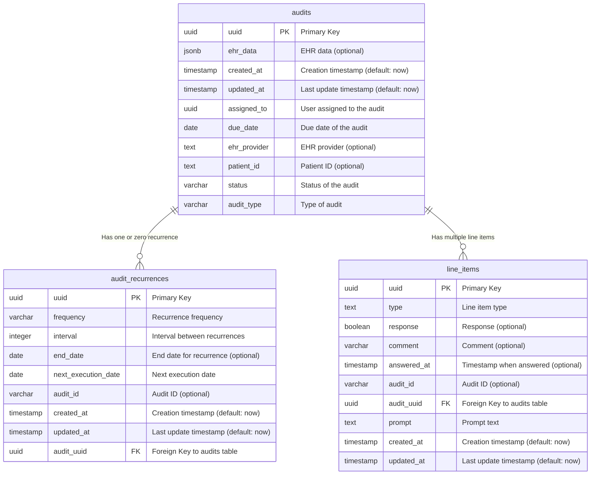
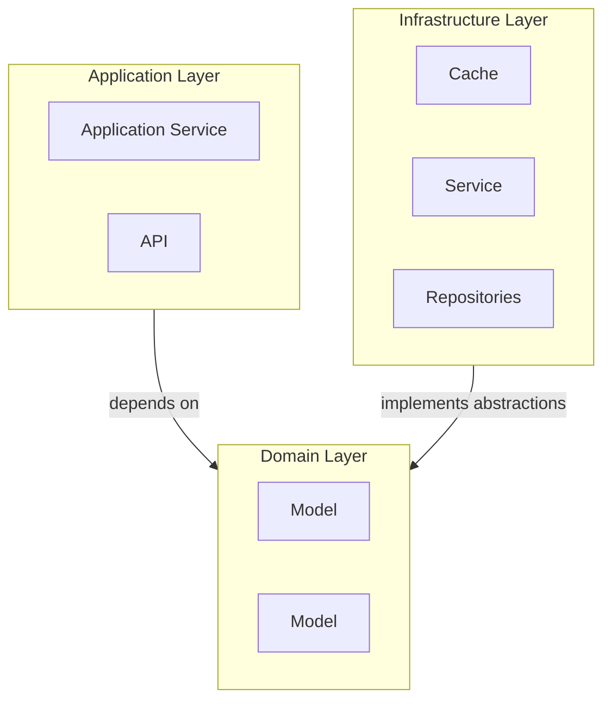
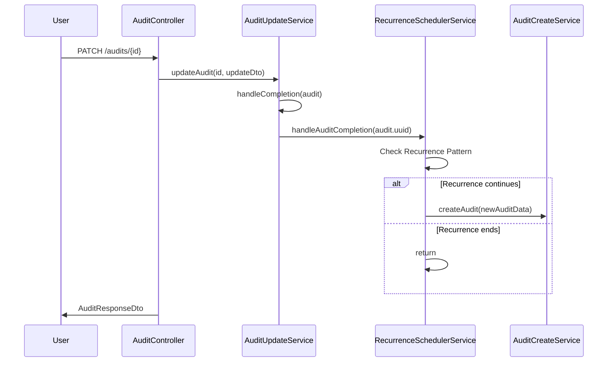

# Decision Framework and Architecture Options for Standard Work Audits Module

## Decision Framework

To make an informed decision on the architecture for the Standard Work Audits module, the following criteria will guide us:

1. **Development Speed**: How quickly the solution can be implemented.
2. **Scalability**: The ability to handle increased workload as the startup grows.
3. **Cost Efficiency**: Minimizing upfront and operational costs.
4. **Ease of Maintenance**: Simplicity in managing and iterating on the system.
5. **Integration Potential**: How easily the architecture integrates with external systems (e.g., hospital EHR systems).
6. **Team Expertise**: Alignment with the current skillset and capacity of the development team.

---

## Architecture Options

### **Option 1: Modular Microservices Architecture**

#### Overview

A highly scalable system where each feature (e.g., task management, audit CRUD, notifications) is built as an independent service, communicating via APIs.

#### Pros:

- **Scalability**: Each service can scale independently, ensuring high performance under heavy loads.
- **Flexibility**: Easy to extend and add new features without disrupting the overall system.
- **Fault Isolation**: Failures in one service do not impact others.
- **Integration**: Works seamlessly with external systems via well-defined APIs.

#### Cons:

- **Development Speed**: Slower to implement due to the need for service orchestration and communication.
- **Complexity**: Requires advanced infrastructure like Kubernetes and service discovery tools.
- **Cost**: Higher initial and operational costs.
- **Team Expertise**: Demands proficiency in distributed systems and DevOps.

#### Best For:

Startups with plans for long-term scalability and engineering resources to handle complexity.

---

### **Option 2: Serverless Architecture**

#### Overview

Leverages cloud-native serverless services (e.g., AWS Lambda) for modular components. Each function is independently deployed and triggered as needed.

#### Pros:

- **Cost Efficiency**: Pay-as-you-go pricing minimizes costs for compute resources.
- **Development Speed**: Quick to develop and deploy with prebuilt serverless components.
- **Scalability**: Automatic scaling based on demand.
- **Ease of Maintenance**: No infrastructure management required.
- **Integration**: Lightweight APIs simplify external system integrations.

#### Cons:

- **Cold Start Latency**: Functions may experience delays during infrequent use.
- **Execution Limits**: Constrained by serverless platform limits (e.g., memory, runtime).
- **Vendor Lock-in**: Tied to a specific cloud provider's ecosystem.
- **Complexity at Scale**: Managing many serverless functions can become challenging over time.

#### Best For:

Startups with limited budgets and the need for rapid prototyping or launching an MVP.

---

### **Option 3: Monolithic Application**

#### Overview

A single application handles all functionality, including task management, audit CRUD, and notifications.

#### Pros:

- **Development Speed**: Quick to develop and deploy.
- **Cost Efficiency**: Low initial and operational costs.
- **Ease of Maintenance**: Simpler to manage a single codebase.
- **Team Expertise**: Easier for teams unfamiliar with distributed systems.

#### Cons:

- **Scalability**: Limited; requires significant refactoring for high workloads.
- **Integration**: Tight coupling makes integration with external systems harder.
- **Technical Debt**: Changes to one part of the application can disrupt others.

#### Best For:

Startups in early stages prioritizing speed and cost-efficiency over long-term scalability.

---

### **Option 4: Hybrid Architecture**

#### Overview

Combines microservices for critical components with a monolithic core for simpler functions.

#### Pros:

- **Balanced Flexibility**: Combines the best of monolithic and microservices architectures.
- **Cost Efficiency**: Keeps simpler functions in a monolith to reduce costs.
- **Development Speed**: Faster than fully microservices, while enabling scalability for key components.
- **Scalability**: Supports growth without over-engineering initially.

#### Cons:

- **Complexity**: Requires management of both monolith and microservices components.
- **Integration**: Additional integration layers can add complexity.
- **Team Expertise**: Requires knowledge in both monolith and distributed systems.

#### Best For:

Startups with moderate technical capacity needing scalability and incremental delivery.

---

### **Option 5: Lambda Monolith**

#### Overview

A single monolithic application deployed inside a serverless runtime (e.g., AWS Lambda). Combines the simplicity of monoliths with serverless scalability.

#### Pros:

- **Development Speed**: Rapid development and deployment within a single codebase.
- **Scalability**: Lambda’s auto-scaling handles increased workload efficiently.
- **Cost Efficiency**: Pay only for actual compute time.
- **Ease of Maintenance**: Simple to debug and manage with all functionality in one application.
- **Integration**: Seamless integration with APIs and event triggers.
- **Team Expertise**: Accessible for smaller teams familiar with monolith design.

#### Cons:

- **Cold Start Latency**: Potential delays during infrequent function calls.
- **Execution Limits**: Constrained by Lambda’s runtime and memory limits.
- **Vendor Lock-in**: Dependent on the serverless platform’s ecosystem.

#### Best For:

Startups looking for a cost-efficient, scalable solution without the complexity of full microservices.

---

## Decision

Based on the outlined criteria and trade-offs, the **Lambda Monolith** architecture is the most suitable choice for the current needs of the startup. It balances the following:

- **Rapid development** for getting to market quickly.
- **Scalability** for handling fluctuating workloads.
- **Cost-efficiency** by leveraging serverless pay-as-you-go pricing.
- **Simplicity** in management and debugging for a small team.

This approach allows the startup to focus on delivering value while ensuring scalability and operational efficiency as the business grows.

---

## Implementation Plan: Lambda Monolith

### **Incremental Scalability Strategy**

The Lambda Monolith will be designed with a future-oriented, incremental scalability approach:

1. **Start as a Monolith in Lambda**:

   - Implement all business logic as a cohesive unit to simplify development and deployment.
   - Deploy the application in AWS Lambda to leverage serverless scalability.

2. **Monitor Traffic and Performance**:

   - Continuously monitor usage patterns and bottlenecks using AWS CloudWatch.
   - Scale Lambda resources dynamically to handle traffic spikes.

3. **Transition to a Running Service**:

   - As traffic grows, migrate the monolith to a long-running containerized service (e.g., AWS ECS/Fargate or Kubernetes).
   - Enable persistent connections and lower latency for high-throughput demands.

4. **Break into Microservices as Needed**:

   - Identify domain boundaries and split components (e.g., audit CRUD, notifications) into independent microservices when necessary.
   - Use APIs or messaging queues (e.g., Amazon SQS) to enable communication between services.

## Technology Choices and Rationale

### **NestJS**

- **Robustness**: Provides a modular architecture with built-in support for dependency injection, middleware, and decorators, making it highly extensible and scalable.
- **Lift-and-Shift Capabilities**: Its structure aligns with a microservices-based approach, enabling an easy transition if the application grows to require service decoupling.
- **Familiarity**: NestJS has a strong ecosystem and aligns well with teams proficient in TypeScript and JavaScript.

### **Aurora Serverless with PostgreSQL**

- **Relational Strengths**: PostgreSQL offers a robust relational database system with strong support for complex queries, transactions, and constraints, ensuring data integrity.
- **Scalability**: Aurora Serverless auto-scales the database capacity based on demand, reducing the overhead of managing database resources.
- **Integration with AWS**: Aurora Serverless integrates seamlessly with AWS Lambda and other AWS services, optimizing serverless workflows.
- **Cost Efficiency**: Operates on a pay-as-you-go model, minimizing costs during low activity while accommodating growth seamlessly.
- **Flexibility for Future Requirements**: PostgreSQL’s JSONB support enables semi-structured data storage, allowing adaptability for evolving audit requirements.

# High Level Architecture


# Core Domain: Auditing

The **Audit** domain serves as the central concept for all audit-related workflows. It manages the lifecycle of audits, from configuration to execution and reporting.

### Responsibilities

- Handle audit scheduling and assignments.
- Facilitate audit execution and answer submissions.
- Evaluate compliance based on submitted answers.
- Provide insights and reports for audits.

### Ubiquitous Language

- **Audit**: A structured evaluation process that assesses compliance with defined standards or procedures. It is the central entity in the auditing process, containing associated **Line Items** and managed by a **Recurrence Schedule** when applicable.
- **Recurrence Schedule**: A plan defining how and when an **Audit** is repeated over time. It specifies the frequency (e.g., weekly, monthly), interval (e.g., every 2 weeks), and optional end date for automated scheduling of recurring audits.
- **Line Item**: An individual question, task, or prompt within an **Audit** that requires assessment or response. Each **Line Item** captures specific information through a prompt, expected response type, and any optional comments or metadata.

## Data Model

This data model is intentionally simple! The model allows us to assign and store audits withouht having to immediately implement the configuration management aspect of the API. The data model emphasizes flexibility and extensibility, reflecting the following considerations:

- **Line Items as a Generic Concept:** Line items represent questions or prompts within an audit. By making them generic, the model allows for diverse types of responses and metadata. These can be expanded as needed.
- **Audit and Line Item Relationship:** Audits encapsulate multiple line items, forming the basis of modularity and separation of concerns.
- **Recurrence**: Model for representing different forms of occurrence. Flexible and also extensible.

### ER Diagram



## Directory Structure

The design follows a directory structure that mirrors the core domain and subdomains, ensuring clear organization and separation of concerns.

### Example Tree Structure

Below is an example of an actual implementation of the directory structure based on current progress:

```
src
├── audit
│   └── audit-execution
│       ├── application
│       │   ├── controllers
│       │   ├── dtos
│       │   └── services
│       ├── domain
│       │   ├── config
│       │   ├── entities
│       │   ├── errors
│       │   ├── ports
│       │   └── types
│       └── infra
│           ├── adapters
│           ├── db
│           │   └── table
│           ├── mappers
│           └── repositories
├── config
├── ehr
│   ├── application
│   │   ├── services
│   │   └── use-cases
│   │       ├── cerner
│   │       └── epic
│   ├── domain
│   │   ├── entities
│   │   └── ports
│   └── infra
│       ├── adapters
│       ├── mappers
│       └── types
├── health
└── interceptors
```

This structure highlights:

- The modular organization of the `audit` domain into subdomains like `audit-execution`.
- Clear separation of `application`, `domain`, and `infra` layers consistent with Hexagonal Architecture principles.
- Progress toward a complete implementation, with room for additional subdomains like `audit-configuration` and `audit-reporting`.

---

## Hexagonal Architecture Design

To implement Hexagonal (Ports and Adapters) Architecture, the design ensures clear separation between the core domain logic and external systems ([an excellent reference](https://github.com/Sairyss/domain-driven-hexagon)).

### Layers

#### Domain Layer

This layer houses the core _business_ logic, entities, and services. It is completely independent of frameworks, databases, or external systems.

**Key Components:**

- **Entities:** Represent core concepts like `Audit`, and `LineItem`, or `Patient` (not a FHIR patient, but an abstraction).
- **Domain Services:** Implement business logic, such as compliance validation and audit creation.

#### Application Layer

This layer coordinates the application's use cases and serves as an intermediary between the domain layer and external systems.

**Key Components:**

- **Use Case Services:** Implement workflows like scheduling audits, submitting answers, and generating reports.
- **API**: Implement controllers that define the API contract externally.

#### Ports and Adapters

This layer handles interaction with external systems (e.g., databases, APIs, UI) via well-defined interfaces (ports). Adapters implement these interfaces.

**Key Components:**

- **Ports:** Define interfaces for external interactions, such as `AuditRepository` and `NotificationService`.
- **Adapters:** Provide implementations for these interfaces, such as a database adapter for storing audits.



## EHR Integration Strategy

Ports in Hexagonal Architecture, combined with NestJS dependency injection, provide an ideal mechanism for our EHR integration strategy. This approach enables the definition of a common interface for interactions while abstracting the underlying implementations. By adhering to the defined contract, each adapter ensures the integrity and consistency of the overall system.

### EHR Provider Port

A port is defined to encapsulate the interactions with EHR systems. This enabling flexibility and adaptability for various providers such as Cerner and Epic.

```typescript
export const EHR_PROVIDER = Symbol('EHR_PROVIDER');

export interface EHRProviderPort {
  getPatient(patientId: string): Promise<Patient>;
  getPatientConditions(patientId: string): Promise<Condition[]>;
}
```

### Example: Cerner Adapter

The following adapter implements the `EHRProviderPort` for the Cerner EHR system. It maps data from the FHIR standard to the _domain entities_.

```typescript
export class CernerAdapter implements EHRProviderPort {
  async getPatient(patientId: string): Promise<Patient> {
    const patient = // some api request here

    return PatientMapper.toDomain(fhirPatient);
  }

  async getPatientConditions(patientId: string): Promise<Condition[]> {
    const conditions = // some api request here

    return fhirConditions.map((condition) =>
      ConditionMapper.toDomain(condition),
    );
  }
}
```

### Dynamic Service Injection

The `EHRService` dynamically injects the appropriate provider based on the specified EHR system. We simply provide a injection token and establish each EHR provider in our module and it's ready to be consumed (injected) in our EHR Service class:

```typescript
// ehr.module.ts
@Module({
  providers: [
    {
      provide: EHR_PROVIDER,
      useClass: CernerAdapter,
    },
    {
      provide: EHR_PROVIDER,
      useClass: EpicAdapter,
    },
    EHRService,
  ],
  exports: [EHRService],
})
export class EHRModule {}

// ehr.service.ts
@Injectable()
export class EHRService {
  constructor(
    @Inject(EHR_PROVIDER) private readonly cernerProvider: EHRProviderPort,
    @Inject(EHR_PROVIDER) private readonly epicProvider: EHRProviderPort,
  ) {}

  async getPatient(providerId: string, patientId: string): Promise<Patient> {
    const provider = this.getProvider(providerId);
    return provider.getPatient(patientId);
  }

  async getPatientConditions(
    providerId: string,
    patientId: string,
  ): Promise<Condition[]> {
    const provider = this.getProvider(providerId);
    return provider.getPatientConditions(patientId);
  }

  private getProvider(providerId: string): EHRProviderPort {
    switch (providerId.toLowerCase()) {
      case EHRProviderType.CERNER:
        return this.cernerProvider;
      case EHRProviderType.EPIC:
        return this.epicProvider;
      default:
        throw new Error(`Unsupported EHR provider: ${providerId}`);
    }
  }
}
```

## Workflow for Recurrence Management

Recurrence functionality is integral to automating the audit lifecycle. The following sequence diagram illustrates how recurrence is triggered upon audit completion:



---

## Evolutions for Recurrence Implementation

### **1. Event-Driven Design**

#### Approach:

- Emit events like `AuditUpdatedEvent` to a message broker (e.g., RabbitMQ, Kafka).
- Event listeners handle the recurrence logic and trigger downstream actions like creating a new audit.

#### Benefits:

- High scalability and decoupled architecture.
- Real-time processing with better fault isolation.
- Ideal for large-scale systems.

### **2. Cron Job Design**

#### Approach:

- Use a scheduled job to periodically query audits with due recurrences.
- Process all eligible records in batches.

#### Benefits:

- Simplified setup and low operational overhead.
- Best suited for small to medium-scale systems with predictable workloads.
